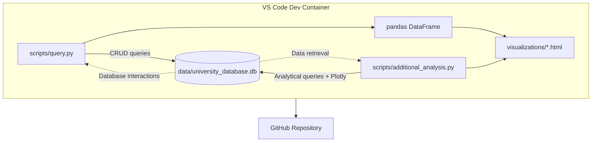

# university-database
This repository explores relational databases and CRUD operations using SQLite and Python (pandas). It includes a pre-built SQLite database (university_database.db) containing university ranking data from 2012–2015.

The project runs in a reproducible Dev Container environment with all dependencies and tools (Python, SQLite, and Plotly) preinstalled.

---

## 🚀 Features

- SQLite database integration and exploration via **SQL** and **Python**
- SQL-based CRUD operations (Create, Read, Update, Delete)
- Data analysis and visualization with Plotly
- Ready-to-use Dev Container for seamless setup
- Includes helper scripts to run and visualize queries (`scripts/query.py`)

---

## 🧩 Dev Container Setup

The .devcontainer configuration ensures the environment is **always ready** — no manual installs are required.
##### 🔧 Includes
- Python 3.12
- SQLite3 CLI
- pandas, plotly, sqlite-utils
- VS Code SQLite extensions preinstalled

---

## Project Structure

```markdown
| `.devcontainer/` | Dev Container configuration for VS Code |
| ├── `devcontainer.json` | Defines container environment and extensions |
| └── `Dockerfile` | Installs Python, SQLite, and dependencies |
| `data/` | Contains the SQLite database |
| └── `university_database.db` | Pre-built database with university rankings (2012–2015) |
| `scripts/` | All Python and SQL scripts |
| ├── `query.py` | Performs CRUD operations on the database |
| ├── `crud_ops.sql` | SQL version of the CRUD operations |
| ├── `additional_analysis.py` | Generates visualizations and advanced queries |
| └── `test_connection.py` *(optional)* | Verifies database connection |
| `visualizations/` | Folder containing generated HTML visualizations |
| ├── `top_countries_top100.html` | Bar chart of top 10 countries by top-100 universities |
| ├── `score_distribution_top10_countries.html` | Box plot of score distributions |
| └── `score_change_2014_2015.html` | Horizontal bar chart of top score changes |
| `requirements.txt` | Python dependencies (pandas, plotly, sqlite-utils) |
| `README.md` | Project overview and documentation |
```

---

## DB Connection Test:

```bash
import sqlite3

try:
    conn = sqlite3.connect("data/university_database.db")
    cur = conn.cursor()
    cur.execute("SELECT name FROM sqlite_master WHERE type='table';")
    print("Connected successfully. Tables:", cur.fetchall())
    conn.close()
except Exception as e:
    print("Connection failed:", e)

```
Outputs:


---

## 🧱 Project Architecture

Here’s how everything connects inside the Dev Container:


---

## 💡 Viewing Visualizations
After running `python scripts/additional_analysis.py`, open the generated HTML files in your browser:

```bash
open visualizations/top_countries_top100.html
open visualizations/score_distribution_top10_countries.html
open visualizations/score_change_2014_2015.html
```

---

## Visualization
1. Score distributions across the top 10 countries:


2. Top countries having their universities in top 100


3. Score change from 2014 -> 2015 in top countries


---